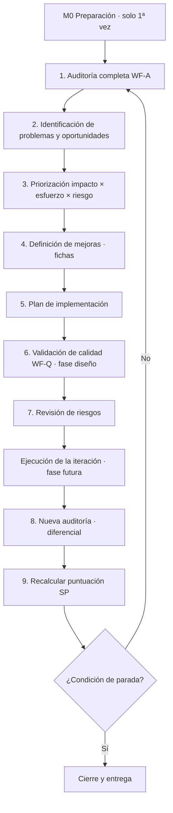
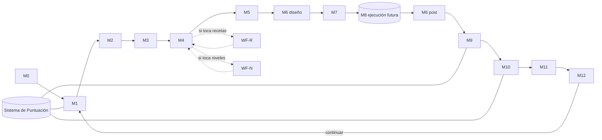

# Sistema Maestro de Mejora Continua — DietMaster Pro → 100/100

**Estado:** DISEÑO COMPLETO — PENDIENTE DE EJECUCIÓN (este documento no ejecuta nada)
**Versión:** 1.0 · **Fecha:** 2026-07-09
**Ámbito:** define CÓMO una IA transformará la aplicación en una app de nutrición de nivel 100/100. No contiene mejoras, código de producto, recetas ni diseños de pantalla.

---

## 0. Contexto y reglas del sistema

### 0.1 Aplicación objetivo (estado real, sin auditar)

DietMaster Pro: PWA para nutricionistas construida con React + TypeScript + Vite, Supabase (Postgres + RLS), Gemini (generación de planes), exportación PDF y modo offline (service worker). Módulos existentes que el sistema tratará como superficie auditable:

| Área | Módulos reales |
|---|---|
| Núcleo clínico | `utils/calculations.ts`, `utils/clinicalSafety.ts`, `utils/clinicalTargets.ts`, `utils/macroValidation.ts` |
| Generación IA | `services/geminiService.ts` (prompts, parsing, guardrails) |
| Datos | `services/supabaseClient.ts`, `hooks/useAppData.ts`, `docs/supabase/*.sql` |
| Experiencia | `components/` (PatientForm, DietPlanDisplay, ProgressTracker, CouplesDietView, FoodDatabase, RecipeSearch, Dashboard, Sidebar/MobileNav) |
| Salidas | `services/pdfService.ts`, `services/exportService.ts`, `utils/shoppingList.ts` |
| Calidad actual | `test/*.test.ts` (Vitest) |

### 0.2 Roles

| Rol | Quién | Función |
|---|---|---|
| IA-Orquestador | Sesión principal (Claude Code) | Dirige el loop, integra resultados, mantiene el scorecard |
| IA-Especialista | Subagentes disponibles: `typescript-reviewer`, `security-reviewer`, `database-reviewer`, `healthcare-reviewer`, `performance-optimizer`, `e2e-runner`, `planner`, `architect`, `refactor-cleaner` | Auditoría y revisión por dominio |
| Humano-PO | Fran (product owner) | Prioridades de negocio, aprobación de iteración, decisión de parada |
| Humano-DN | Dietista-nutricionista colegiado/a | Sign-off clínico obligatorio de contenido nutricional |

### 0.3 Reglas de oro (aplican a todo el sistema)

1. **La seguridad clínica veta todo.** Ninguna mejora se acepta si degrada Nutrición o Seguridad alimentaria, aunque suba la nota global.
2. **Sin evidencia no hay puntos.** Toda puntuación y todo delta se justifica con un artefacto verificable (salida de comando, informe, referencia científica, captura).
3. **Auditor ≠ implementador.** El agente que re-audita (M9) nunca es el que implementó (M8).
4. **Iteraciones pequeñas.** Máximo 5–8 mejoras por iteración; 1 iteración = 1 rama = 1 PR.
5. **Datos de pacientes = datos de salud (RGPD art. 9).** Las pruebas usan exclusivamente datos sintéticos.
6. **Todo queda registrado.** Cada iteración deja artefactos versionados en `docs/loop/` (ver §12).

---

## 1. FASE 1 — Workflow de Auditoría (WF-A)

### 1.1 Proceso

| Paso | Actividad | Salida |
|---|---|---|
| A1 | **Recolección de evidencias**: ejecutar suite de tests, build, análisis estático (`tsc --noEmit`), Lighthouse, axe-core, análisis de bundle, revisión de esquema Supabase (advisors), inventario de recetas y prompts | Paquete de evidencias crudas |
| A2 | **Evaluación por categoría**: cada categoría la evalúa su agente responsable (tabla 1.2) contra su rúbrica (§1.3) usando solo evidencias de A1 + inspección de código/contenido | 16 fichas de categoría con hallazgos |
| A3 | **Puntuación**: aplicar el Sistema de Puntuación (§2) a cada ficha | 16 notas 0–100 + nota global |
| A4 | **Informe**: consolidar hallazgos ordenados por severidad, con localización (`fichero:línea` o pantalla/flujo) y evidencia enlazada | `AUDITORIA.md` de la iteración |
| A5 | **Baseline / diff**: registrar en el scorecard; si no es la primera auditoría, calcular delta contra la anterior | `SCORECARD.md` actualizado |

**Modalidad diferencial:** a partir de la iteración 2, WF-A se ejecuta en modo diferencial (solo categorías tocadas por la iteración + comprobaciones de regresión de las críticas). Cada 3 iteraciones se ejecuta una auditoría completa.

### 1.2 Categorías, pesos, método y responsable

| # | Categoría | Peso | Qué se evalúa | Método y herramientas concretas | Responsable |
|---|---|---|---|---|---|
| 1 | Nutrición | 12% | Exactitud de fórmulas (BMR/TDEE en `calculations.ts`), rangos de macros (`macroValidation.ts`), objetivos clínicos (`clinicalTargets.ts`), micronutrientes, coherencia kcal↔macros de los planes generados | Contraste contra guías (EFSA, OMS, SENC, posicionamientos AND/Academy); tests unitarios como evidencia; muestreo de 20 planes generados recalculados a mano | `healthcare-reviewer` + Humano-DN |
| 2 | Seguridad alimentaria | 10% | 14 alérgenos UE, poblaciones de riesgo (embarazo, TCA, IMC extremo — `clinicalSafety.ts`), mínimos calóricos seguros, interacciones patología-dieta, avisos y disclaimers | Checklist de seguridad clínica por flujo; casos límite sintéticos (paciente embarazada, IMC<18.5, alergia múltiple) pasados por el generador | `healthcare-reviewer` + Humano-DN |
| 3 | Motor de recetas | 9% | Variedad, tasa de repetición entre planes, datos nutricionales por receta, cobertura por objetivo/patología/cultura, ICR medio (§5) | Inventario del corpus (FoodDatabase + salidas de Gemini); scoring ICR muestral; matriz de cobertura | IA-Orquestador (con WF-R) |
| 4 | IA | 8% | Calidad de prompts (`geminiService.ts`), tasa de JSON válido, guardrails, alucinaciones nutricionales, coste y latencia por generación | Batería de evals: ≥30 casos sintéticos de referencia con salida esperada; medición de tasa de error, latencia p95 y coste medio | IA-Orquestador |
| 5 | UX | 8% | Flujos críticos (crear paciente → generar plan → ajustar → exportar PDF → seguimiento), fricción (nº de clics), estados vacíos/error/carga, mensajes | Recorridos E2E instrumentados (`e2e-runner`); heurísticas de Nielsen; conteo de pasos por tarea | `e2e-runner` + Humano-PO |
| 6 | Personalización | 8% | Variables capturadas en `PatientForm` (objetivos, patologías, alergias, preferencias, presupuesto, horarios) y cuántas influyen realmente en el plan; adaptación al progreso real | Trazabilidad campo→prompt→plan: matriz de variables declaradas vs. usadas | IA-Orquestador + Humano-DN |
| 7 | Arquitectura | 7% | Acoplamiento (tamaño de `App.tsx` y `useAppData`), separación de capas, tipado estricto, duplicación, gestión de estado, manejo de errores | `tsc --noEmit`, métricas de tamaño/complejidad por fichero, revisión de dependencias entre módulos | `architect` + `typescript-reviewer` |
| 8 | Rendimiento | 6% | LCP, INP, CLS, tamaño de bundle, re-renders, tiempo de generación de plan | Lighthouse CI (móvil y desktop), `vite build` con análisis de bundle, React Profiler en flujos críticos | `performance-optimizer` |
| 9 | Escalabilidad | 5% | RLS y políticas Supabase, índices, consultas N+1, multi-tenant (varias nutricionistas), límites de localStorage vs. remoto, offline (sw.js) | Supabase advisors, revisión de `couples_diets.sql` y esquema, prueba de volumen sintética (500 pacientes) | `database-reviewer` |
| 10 | Accesibilidad | 5% | WCAG 2.2 AA: contraste, foco, teclado, etiquetas ARIA, lector de pantalla, tamaños táctiles | axe-core automatizado en todas las vistas + recorrido solo-teclado + zoom 200% | `e2e-runner` (audit a11y) |
| 11 | UI | 5% | Consistencia visual (tokens Tailwind), jerarquía, responsive (375/768/1280), modo oscuro, densidad de información clínica | Inspección sistemática por vista con capturas en 3 breakpoints × 2 temas; checklist de consistencia | IA-Orquestador + Humano-PO |
| 12 | Retención | 5% | Motivos de vuelta (recordatorios `useNotifications`, seguimiento, informes), fricción de re-uso, presencia de analítica para medir uso real | Inventario de mecanismos de retención existentes vs. matriz de referencia del sector; verificación de instrumentación | Growth (IA) + Humano-PO |
| 13 | Monetización | 4% | Modelo (licencia por nutricionista / suscripción), pricing, límites de plan gratuito, facturación, valor percibido | Análisis de modelo vs. mercado ES; revisión de infraestructura de pago disponible (Stripe) | Growth (IA) + Humano-PO |
| 14 | Gamificación | 3% | Feedback de progreso (ProgressTracker), hitos, rachas de adherencia, refuerzo positivo clínicamente apropiado | Inventario vs. catálogo de mecánicas apropiadas para salud (sin dark patterns ni presión sobre TCA) | Growth (IA) + Humano-DN |
| 15 | Calidad del contenido | 3% | Textos de UI, tono clínico, ortografía ES, consistencia terminológica, calidad de PDFs generados (`pdfService`) | Revisión lingüística sistemática + muestreo de 10 PDFs generados | IA-Orquestador + Humano-DN |
| 16 | Competencia | 2% | Posición vs. Nutrium, Dietopro, i-Diet, Nutritics y apps consumer (MyFitnessPal, Yazio) | Matriz feature-gap actualizada por investigación web; identificación de diferenciales defendibles | Growth (IA) |

**Suma de pesos = 100%.** Los pesos solo pueden cambiarse en M12 con aprobación del Humano-PO y quedan registrados en el scorecard.

### 1.3 Rúbrica de puntuación por categoría

Cada categoría tiene una checklist de criterios verificables (la versión "al 100" está en §8). La nota de categoría = suma de puntos de criterios cumplidos **con evidencia**. Bandas de interpretación:

| Banda | Significado |
|---|---|
| 0–39 | Deficiente: riesgos activos o funcionalidad ausente |
| 40–59 | Básico: funciona pero por debajo del estándar profesional |
| 60–74 | Funcional: usable en consulta real con limitaciones |
| 75–89 | Competitivo: comparable a herramientas comerciales del sector |
| 90–98 | Excelente: mejor que la media del mercado, sin hallazgos graves |
| 99–100 | Referente: cumple el 100% de los criterios de §8, verificado |

**Regla de anclaje:** el evaluador no asigna la nota "a ojo"; marca criterios de la checklist y la nota se deriva. Un criterio sin evidencia adjunta cuenta como NO cumplido.

---

## 2. Sistema de Puntuación (SP)

### 2.1 Fórmula

```
Nota global = Σ (nota_categoría × peso_categoría)        [0–100, 2 decimales]
```

Con dos correcciones no negociables:

- **Tope de seguridad:** si Nutrición < 80 o Seguridad alimentaria < 80, la nota global se **capa a 59** (una app clínicamente insegura no puede ser "competitiva").
- **Tope de mínimos:** ninguna nota global ≥ 90 es válida si alguna categoría < 70.

### 2.2 Reglas anti-inflación

1. Un punto solo sube con evidencia adjunta y reproducible (comando + salida, informe, referencia, captura fechada).
2. Deltas > +5 puntos en una categoría en una iteración requieren segunda verificación por un agente distinto.
3. El 100 en Nutrición y Seguridad alimentaria solo lo otorga el Humano-DN por escrito.
4. La puntuación **puede bajar**: si una evidencia deja de ser reproducible en re-auditoría, el criterio pasa a NO cumplido.
5. El scorecard vive en git; cada cambio referencia iteración, criterio y evidencia (trazabilidad completa).
6. Prohibido redondear hacia arriba entre bandas: 89.9 es 89.9, no 90.

### 2.3 Artefactos

- `docs/loop/SCORECARD.md` — tabla viva: categoría × iteración, con enlaces a evidencias.
- `docs/loop/iteracion-NNN/AUDITORIA.md` — informe completo de la iteración.

---

## 3. FASE 2 — Loop Maestro (LM)

### 3.1 Flujo



### 3.2 Los 9 pasos: entradas, salidas y criterio de avance

| Paso | Entrada | Salida | Criterio para avanzar (gate) |
|---|---|---|---|
| 1. Auditoría completa | Código actual + scorecard previo | `AUDITORIA.md` + 16 notas | Las 16 categorías evaluadas con evidencia; ningún "sin datos" |
| 2. Identificación | `AUDITORIA.md` | `BACKLOG.md`: lista de problemas (P-nnn) y oportunidades (O-nnn) con categoría, severidad y evidencia | Cada ítem tiene localización y criterio de "resuelto" medible |
| 3. Priorización | `BACKLOG.md` | Backlog ordenado + selección de iteración (5–8 ítems) | Fórmula aplicada (§3.3); bloqueantes de seguridad siempre incluidos; Humano-PO conforme con la selección |
| 4. Definición de mejoras | Ítems seleccionados | Fichas de mejora (§4, M4): problema, solución propuesta, criterios de aceptación, Δ puntos estimado | Toda ficha estima su impacto en ≥1 criterio de §8 |
| 5. Plan de implementación | Fichas aprobadas | `PLAN.md`: orden, dependencias, plan de pruebas, plan de rollback por mejora | Ninguna mejora sin plan de prueba y rollback |
| 6. Validación de calidad | Fichas + plan | Veredicto WF-Q fase diseño por ficha (§7) | Q1, Q2, Q4, Q5 en verde para cada ficha; las rechazadas vuelven al paso 4 |
| 7. Revisión de riesgos | Plan validado | `RIESGOS.md`: riesgo clínico, técnico, de datos (RGPD), de UX; mitigación por riesgo | Ningún riesgo "alto" sin mitigación aceptada; riesgos clínicos altos requieren visto bueno Humano-DN |
| — Ejecución (futura) | `PLAN.md` | Código en rama `loop/iteracion-NNN` + gates WF-Q post-implementación | Fuera del alcance de este diseño; definida en M8 |
| 8. Nueva auditoría | Rama con cambios | `AUDITORIA.md` diferencial | Regresión cero en Nutrición y Seguridad alimentaria; suite de tests verde |
| 9. Recalcular puntuación | Auditoría diferencial | `SCORECARD.md` + `DELTA.md` (qué subió, por qué, evidencia) | Deltas justificados según §2.2; scorecard commiteado |

### 3.3 Fórmula de priorización (paso 3)

```
Prioridad = (Impacto × Confianza) / Esfuerzo,  con vetos
```

- **Impacto** (1–10): Δ puntos estimado en la nota global, ponderado por peso de categoría.
- **Confianza** (0.5–1.0): solidez de la evidencia de que el problema existe y la solución funciona.
- **Esfuerzo** (1–10): tamaño estimado de implementación + prueba.
- **Vetos:** (a) todo bloqueante de Seguridad alimentaria/Nutrición entra automáticamente en la siguiente iteración, saltándose la fórmula; (b) ningún ítem de Gamificación/Monetización entra mientras exista un bloqueante clínico abierto.

### 3.4 Condiciones de parada del loop

| Tipo | Condición | Acción |
|---|---|---|
| ÉXITO | Nota global = 100 según SP (todas las categorías cumplen §8 al completo) | Cierre, informe final, entrega |
| ESTANCAMIENTO | Δ global < 1 punto durante 2 iteraciones consecutivas | Escalada a Humano-PO: continuar con nueva estrategia, congelar nota, o cerrar |
| PARADA DURA | Cualquier regresión en Nutrición o Seguridad alimentaria | Rollback inmediato de la iteración + bloqueo del loop hasta revisión Humano-DN |
| PRESUPUESTO | Se agota el presupuesto de la iteración (tiempo/tokens definido en M0) | Cerrar iteración con lo validado; lo demás vuelve al backlog |
| CHECKPOINT HUMANO | Cada 3 iteraciones | El loop no continúa sin aprobación explícita del Humano-PO |

### 3.5 Métricas de éxito del loop (proceso)

| Métrica | Objetivo |
|---|---|
| Δ puntos globales por iteración | ≥ +2 en iteraciones 1–5; ≥ +1 después |
| % de mejoras aprobadas por WF-Q al primer intento | ≥ 70% |
| Regresiones en categorías críticas | 0 (tolerancia cero) |
| Cobertura de tests del núcleo clínico (`utils/`) | Nunca decrece; objetivo ≥ 90% |
| Lead time por mejora (ficha → validada) | ≤ 1 iteración |
| Coste (tokens/tiempo) por punto ganado | Decreciente o estable entre iteraciones |

### 3.6 Cadencia y presupuesto

- 1 iteración = 1 rama (`loop/iteracion-NNN`) = 1 PR = 5–8 mejoras máximo.
- Presupuesto orientativo por iteración: 8–16 h-IA de trabajo efectivo + 30–60 min de revisión humana (PO) + 30–60 min de revisión clínica (DN) cuando la iteración toca contenido nutricional.

---

## 4. FASE 3 — Workflow Maestro (WF-M): módulos

Formato de cada módulo: **Objetivo · Descripción · Entradas · Salidas · Dependencias · Prioridad · Responsable · Tiempo estimado · Criterios de aceptación.**

### M0 — Preparación del entorno (solo una vez)
- **Objetivo:** dejar el sistema listo para la primera iteración.
- **Descripción:** ejecutar la checklist de preparación (§11): baseline de tests/build, ramas, plantillas, presupuesto, asignación de humanos, datos sintéticos.
- **Entradas:** este documento aprobado; repo actual.
- **Salidas:** entorno verificado; `docs/loop/` con plantillas; baseline registrado.
- **Dependencias:** ninguna. · **Prioridad:** bloqueante.
- **Responsable:** IA-Orquestador + Humano-PO. · **Tiempo:** 1–2 h.
- **Aceptación:** los 10 ítems de §11 marcados; tests y build verdes registrados como línea base.

### M1 — Auditoría (WF-A)
- **Objetivo:** obtener la foto objetiva del estado actual.
- **Descripción:** ejecutar §1 completo (o diferencial desde iteración 2). Las 16 categorías pueden auditarse en paralelo por subagentes especialistas.
- **Entradas:** código en rama base; scorecard previo.
- **Salidas:** `AUDITORIA.md`, 16 notas, hallazgos localizados.
- **Dependencias:** M0. · **Prioridad:** bloqueante (nada avanza sin auditoría).
- **Responsable:** IA-Especialistas según tabla 1.2; consolida IA-Orquestador.
- **Tiempo:** completa 3–5 h-IA; diferencial 45–90 min.
- **Aceptación:** gate del paso 1 (§3.2).

### M2 — Síntesis y backlog
- **Objetivo:** convertir hallazgos en trabajo accionable.
- **Descripción:** cada hallazgo se transforma en problema (P-nnn) u oportunidad (O-nnn) con: categoría, severidad (bloqueante/alta/media/baja), evidencia, criterio de resolución medible.
- **Entradas:** `AUDITORIA.md`. · **Salidas:** `BACKLOG.md` acumulativo (los ítems no resueltos persisten entre iteraciones).
- **Dependencias:** M1. · **Prioridad:** alta.
- **Responsable:** IA-Orquestador. · **Tiempo:** 30–45 min.
- **Aceptación:** 100% de hallazgos de severidad ≥ media convertidos en ítems; sin duplicados.

### M3 — Priorización
- **Objetivo:** elegir el subconjunto de mayor retorno para la iteración.
- **Descripción:** aplicar §3.3 al backlog; proponer selección de 5–8 ítems; presentarla al Humano-PO con impacto estimado en puntos.
- **Entradas:** `BACKLOG.md`. · **Salidas:** selección de iteración firmada.
- **Dependencias:** M2. · **Prioridad:** alta.
- **Responsable:** IA-Orquestador propone; Humano-PO decide. · **Tiempo:** 20–30 min + revisión humana.
- **Aceptación:** gate del paso 3 (§3.2).

### M4 — Definición de mejoras (fichas)
- **Objetivo:** especificar cada mejora hasta que sea implementable sin ambigüedad.
- **Descripción:** una ficha por mejora con: problema (evidencia), solución propuesta (qué, no cómo-código), alcance y no-alcance, criterios de aceptación medibles, Δ puntos estimado y criterio de §8 al que apunta, plan de prueba. Si la mejora toca recetas → invoca WF-R (§5); si toca niveles de elaboración → WF-N (§6).
- **Entradas:** selección de M3. · **Salidas:** fichas `MEJORA-NNN.md`.
- **Dependencias:** M3; WF-R/WF-N cuando aplique. · **Prioridad:** alta.
- **Responsable:** IA-Orquestador (con `planner` para las complejas). · **Tiempo:** 1–2 h.
- **Aceptación:** toda ficha pasa Q4 (valor medible); criterios de aceptación verificables por máquina o por checklist humana explícita.

### M5 — Plan de implementación
- **Objetivo:** secuenciar la iteración con seguridad.
- **Descripción:** ordenar fichas por dependencia técnica, definir plan de pruebas por ficha (unitarias + E2E del flujo afectado), plan de rollback (qué se revierte y cómo), y puntos de verificación intermedios.
- **Entradas:** fichas de M4. · **Salidas:** `PLAN.md`.
- **Dependencias:** M4. · **Prioridad:** alta.
- **Responsable:** IA-Orquestador + `architect` si hay cambios estructurales. · **Tiempo:** 45–60 min.
- **Aceptación:** gate del paso 5 (§3.2).

### M6 — Validación de calidad (WF-Q)
- **Objetivo:** garantizar que nada por debajo del estándar entra en la app.
- **Descripción:** aplicar los 9 gates de §7 en dos momentos: (a) fase diseño (Q1, Q2, Q4, Q5 sobre las fichas), (b) fase post-implementación (los 9 gates sobre el resultado).
- **Entradas:** fichas + plan (a); rama implementada (b). · **Salidas:** `VALIDACION.md` con veredicto por mejora: APROBADA / APROBADA CON CONDICIONES / RECHAZADA.
- **Dependencias:** M4–M5 (a); M8 (b). · **Prioridad:** bloqueante.
- **Responsable:** IA-Especialistas por gate (tabla §7); consolida IA-Orquestador. · **Tiempo:** 20–30 min por mejora.
- **Aceptación:** ninguna mejora RECHAZADA avanza; las condicionadas llevan fecha límite de subsanación.

### M7 — Revisión de riesgos
- **Objetivo:** anticipar daños antes de ejecutar.
- **Descripción:** para la iteración completa, evaluar 5 familias: riesgo clínico (¿puede generar una recomendación dañina?), técnico (¿puede romper flujos existentes?), de datos (¿toca datos de salud? ¿RGPD?), de UX (¿aumenta fricción?), de negocio. Cada riesgo: probabilidad × severidad → mitigación o aceptación explícita.
- **Entradas:** `PLAN.md` + `VALIDACION.md` fase diseño. · **Salidas:** `RIESGOS.md`.
- **Dependencias:** M5, M6a. · **Prioridad:** bloqueante para riesgos altos.
- **Responsable:** IA-Orquestador; `security-reviewer` para datos/auth; Humano-DN para clínicos altos. · **Tiempo:** 30 min.
- **Aceptación:** gate del paso 7 (§3.2).

### M8 — Ejecución de la iteración *(fase futura — no cubierta por este diseño)*
- **Objetivo:** implementar las fichas según `PLAN.md`.
- **Descripción:** se define aquí solo su contrato: trabaja en `loop/iteracion-NNN`, una mejora = commits atómicos, tests primero cuando toque lógica clínica, sin desviarse de la ficha sin volver a M4.
- **Entradas:** `PLAN.md` aprobado. · **Salidas:** rama implementada con tests.
- **Dependencias:** M5, M6a, M7. · **Prioridad:** —.
- **Responsable:** IA (agente ejecutor, distinto del auditor de M9). · **Tiempo:** variable (2–8 h por iteración).
- **Aceptación:** suite completa verde; ficha por ficha, criterios de aceptación cumplidos.

### M9 — Verificación y re-auditoría
- **Objetivo:** medir lo que de verdad cambió.
- **Descripción:** WF-A diferencial sobre la rama + verificación explícita de no-regresión en las 4 categorías críticas (Nutrición, Seguridad alimentaria, IA, Motor de recetas) aunque no se hayan tocado.
- **Entradas:** rama de M8. · **Salidas:** `AUDITORIA.md` diferencial.
- **Dependencias:** M8. · **Prioridad:** bloqueante.
- **Responsable:** IA-Especialistas ≠ ejecutor de M8. · **Tiempo:** 45–90 min.
- **Aceptación:** gate del paso 8 (§3.2).

### M10 — Recalcular puntuación
- **Objetivo:** actualizar el scorecard con rigor.
- **Descripción:** aplicar SP (§2) al resultado de M9; generar `DELTA.md` (criterios que cambiaron de estado, con evidencia); activar segunda verificación si algún delta > +5.
- **Entradas:** auditoría diferencial. · **Salidas:** `SCORECARD.md` + `DELTA.md` commiteados.
- **Dependencias:** M9. · **Prioridad:** bloqueante.
- **Responsable:** IA-Orquestador. · **Tiempo:** 15–20 min.
- **Aceptación:** gate del paso 9 (§3.2).

### M11 — Documentación y memoria
- **Objetivo:** que ninguna iteración se pierda.
- **Descripción:** consolidar artefactos de la iteración en `docs/loop/iteracion-NNN/`; actualizar la nota del proyecto en Obsidian (`06 - SaaS/dietmaster-pro.md`); registrar decisiones de arquitectura como ADR breve si las hubo.
- **Entradas:** todos los artefactos de la iteración. · **Salidas:** carpeta de iteración completa + nota Obsidian actualizada.
- **Dependencias:** M10. · **Prioridad:** media (pero obligatoria antes de M12).
- **Responsable:** IA-Orquestador. · **Tiempo:** 20–30 min.
- **Aceptación:** un lector nuevo puede reconstruir qué se hizo y por qué solo con la carpeta.

### M12 — Decisión de continuación
- **Objetivo:** aplicar las condiciones de parada con disciplina.
- **Descripción:** evaluar §3.4 en orden: parada dura → éxito → presupuesto → estancamiento → checkpoint humano. Si ninguna aplica, abrir iteración NNN+1 y volver a M1.
- **Entradas:** scorecard + estado del presupuesto. · **Salidas:** decisión registrada (CONTINUAR / PARAR / ESCALAR) con motivo.
- **Dependencias:** M10, M11. · **Prioridad:** bloqueante.
- **Responsable:** IA-Orquestador ejecuta; Humano-PO decide en checkpoints y escaladas. · **Tiempo:** 10 min.
- **Aceptación:** decisión trazable en el scorecard.

---

## 5. FASE 4 — Workflow del Sistema de Recetas (WF-R)

### 5.1 Índice de Calidad de Receta (ICR)

Toda receta (existente, nueva o de tendencia) se puntúa 0–100 con estas 12 dimensiones. **Publicable si ICR ≥ 80 y los dos gates bloqueantes en verde.**

| Dimensión | Peso | Método de evaluación |
|---|---|---|
| Calidad nutricional | 20 | Perfil macro/micro vs. objetivo del plan; densidad nutricional (índice tipo NRF9.3); recálculo contra base de composición (BEDCA/USDA) |
| Evidencia científica | 12 | Todo beneficio declarado referencia una fuente del listado autorizado (§5.4); sin claims no respaldados |
| Sabor | 10 | Proxy IA (equilibrio de sabores, técnica coherente) + valoración humana muestral + rating de usuarios cuando exista telemetría |
| Facilidad de preparación | 8 | Nº de pasos, técnicas requeridas, disponibilidad de niveles WF-N |
| Ingredientes accesibles | 8 | Disponibles en cesta de referencia de supermercado español; estacionalidad marcada |
| Coste | 8 | €/ración calculado contra cesta de precios de referencia (actualizada semestralmente) |
| Tiempo de elaboración | 8 | Minutos totales y activos, verificados por nivel |
| Adaptación a objetivos | 8 | Existencia de variantes válidas para pérdida/mantenimiento/ganancia |
| Adaptación alergias/intolerancias | 8 | Sustituciones validadas para los alérgenos aplicables; recálculo nutricional de cada sustitución |
| Adaptación cultural | 5 | Base mediterránea + variantes internacionales correctamente adaptadas |
| Presentación | 5 | Instrucciones de emplatado; foto o descripción visual coherente |
| **Seguridad alimentaria** | **GATE** | 14 alérgenos UE etiquetados; temperaturas de cocción/conservación seguras; apta/no-apta por población de riesgo declarada; sin ingredientes contraindicados para las patologías que la app gestiona |
| **Compatibilidad clínica** | **GATE** | La receta respeta `clinicalSafety`/`macroValidation` al insertarse en un plan (no rompe mínimos calóricos ni rangos de macros) |

### 5.2 Pipeline de evolución del corpus (R1–R7)

| Paso | Actividad | Salida | Gate |
|---|---|---|---|
| R1 | Inventario y scoring ICR del corpus actual (FoodDatabase + recetas generadas por Gemini) | Ranking ICR + distribución | Muestra ≥ 50 recetas o 100% si hay menos |
| R2 | Diagnóstico de huecos: matriz cobertura por objetivo × patología × cultura × nivel × coste × momento del día | Mapa de huecos priorizado | Huecos cuantificados |
| R3 | Generación/mejora: la IA produce fichas de receta contra plantilla estándar (ingredientes con gramajes, pasos, macros, alérgenos, variantes) apuntando a los huecos | Fichas candidatas | Ficha completa, sin campos vacíos |
| R4 | Validación automática: recálculo nutricional contra base de composición; detección de alérgenos; gates de seguridad; ICR provisional | Candidatas con ICR ≥ 80 | Ambos gates en verde |
| R5 | Revisión humana (Humano-DN): 100% de recetas nuevas hasta que la tasa de corrección baje de 2%; después muestreo del 20% | Recetas aprobadas | Firma DN registrada |
| R6 | Publicación versionada: alta en el corpus con versión, fecha, autoría (IA/humano) y evidencias | Corpus actualizado | Trazabilidad completa |
| R7 | Telemetría y feedback: ratings, tasa de sustitución pedida por pacientes, recetas ignoradas | Señales → realimentan R1 | — |

### 5.3 Pipeline de tendencias (T1–T5)

| Paso | Actividad | Regla |
|---|---|---|
| T1 | **Radar** (mensual): rastrear tendencias — alta proteína, mediterránea moderna, meal prep, batch cooking, recetas virales, cocinas internacionales — en fuentes gastronómicas y de búsqueda | Cada tendencia entra con ficha: qué es, a quién atrae, riesgo nutricional aparente |
| T2 | **Filtro de idoneidad**: ¿es adaptable de forma saludable? ¿contradice evidencia? (p. ej., detox, ayunos extremos → descartadas con motivo registrado) | Nada se descarta ni acepta sin motivo documentado |
| T3 | **Adaptación saludable**: reformulación de la tendencia a versión clínicamente válida (ajuste de macros, técnicas, porciones) | La versión adaptada debe conservar el atractivo que la hizo tendencia |
| T4 | **Pipeline estándar**: la receta adaptada entra por R3 y pasa R4–R6 sin excepciones | Ninguna receta viral se publica saltándose gates |
| T5 | **Medición**: etiqueta "tendencia" + seguimiento de adopción a 30/90 días; si adopción < umbral, se archiva | El corpus no acumula ruido |

### 5.4 Fuentes de evidencia autorizadas

EFSA (incl. registro de declaraciones de salud autorizadas), OMS, AESAN, guías SENC, posicionamientos de la Academy of Nutrition and Dietetics, guías clínicas de sociedades (SEEN, SEEDO), revisiones sistemáticas/metaanálisis en PubMed. **Regla:** blogs, influencers y medios generalistas pueden inspirar (T1) pero nunca respaldar (Q1).

---

## 6. FASE 5 — Workflow de Niveles de Elaboración (WF-N)

### 6.1 Invariantes (lo que NUNCA cambia entre niveles de una misma receta)

| Invariante | Tolerancia |
|---|---|
| Energía (kcal/ración) | ± 5% |
| Proteína | ± 5% |
| Hidratos y grasas | ± 10% |
| Micronutrientes clave del plan (según objetivo del paciente) | ± 15% |
| Alérgenos | Idénticos o estrictamente menores (una variante nunca añade alérgenos) |
| Identidad del plato | Mismo nombre y rol en el plan (una "lasaña de verduras" sigue siéndolo en todos los niveles) |

### 6.2 Ejes que SÍ varían, por nivel

| Eje | Muy fácil | Fácil | Intermedio | Avanzado |
|---|---|---|---|---|
| Técnicas permitidas | Ensamblar, calentar, hervir, microondas | + plancha, horno básico, salteado | + guisos, papillote, emulsiones simples | Sin restricción (fermentados, baja temperatura, masas) |
| Nº de pasos máx. | 5 | 8 | 12 | Sin límite |
| Utensilios | 1 recipiente + básicos | + sartén/horno | + batidora, varios fuegos | Equipamiento específico permitido |
| Tiempo activo | ≤ 15 min | ≤ 25 min | ≤ 45 min | Sin límite |
| Ingredientes | Se permiten pre-cortados, congelados, conservas de calidad, cocidos envasados | Mezcla de frescos y convenientes | Mayoría frescos | Frescos y elaboraciones propias (caldos, salsas madre) |
| Habilidad asumida | Ninguna | Cortes básicos | Gestión de tiempos en paralelo | Técnica de cocina real |

### 6.3 Proceso de decisión (cómo la IA genera los niveles)

1. **Clasificar la receta base** en su nivel nativo usando la matriz 6.2 (el nivel más bajo cuyas restricciones cumple).
2. **Generar variantes** hacia los demás niveles aplicando el catálogo de transformaciones equivalentes (mantenido como parte del corpus): sustituciones de técnica (horno ↔ airfryer ↔ sartén), de formato de ingrediente (fresco ↔ congelado ↔ conserva al natural), de elaboración (salsa casera ↔ base comercial de composición validada), simplificación o enriquecimiento de pasos.
3. **Recalcular nutrición** de cada variante contra la base de composición y **validar invariantes** (6.1).
4. **Regla de honestidad:** si una variante no puede cumplir los invariantes, ese nivel **no se ofrece** para esa receta (mejor ausencia que error nutricional). Queda registrado el motivo.
5. **Etiquetar cada variante** con su tiempo, utensilios y pasos reales (no heredados de la base).
6. **Pasar por WF-Q**: cada variante es contenido nuevo y pasa los mismos gates que una receta.

### 6.4 Criterios de aceptación del sistema de niveles

- Toda receta publicada ofrece ≥ 2 niveles; objetivo: ≥ 60% del corpus con los 4.
- 0 variantes publicadas con invariantes fuera de tolerancia (verificación automática en R4).
- El nivel mostrado por defecto respeta la preferencia del paciente registrada en su perfil.

---

## 7. FASE 6 — Sistema de Calidad (WF-Q)

Toda mejora pasa los gates dos veces: **fase diseño** (sobre la ficha: Q1, Q2, Q4, Q5) y **fase post-implementación** (los 9). Veredictos: APROBADA / APROBADA CON CONDICIONES (con fecha límite) / RECHAZADA (vuelve a M4).

| Gate | Criterio | Comprobación concreta | Umbral | ¿Bloqueante? |
|---|---|---|---|---|
| Q1 Evidencia científica | Todo contenido clínico nuevo está respaldado | Cada claim mapeado a fuente de §5.4; lista de claims sin fuente = hallazgo | 0 claims sin fuente | Sí |
| Q2 Seguridad | No introduce riesgo clínico ni alimentario | Casos límite sintéticos por `clinicalSafety`/`macroValidation`; checklist de alérgenos; mínimos calóricos | 0 fallos | Sí |
| Q3 Usabilidad | No rompe ni empeora flujos críticos | E2E de los 5 flujos núcleo; conteo de clics antes/después | Flujos completables; clics no aumentan en flujos núcleo | Rotura: sí · Empeora: condiciona |
| Q4 Valor para el usuario | La mejora mueve la aguja | La ficha mapea a ≥ 1 criterio de §8 con Δ puntos > 0 estimado y medible | Mapeo explícito | Sí (evita trabajo cosmético) |
| Q5 Escalabilidad | No hipoteca el crecimiento | Revisión de consultas nuevas (sin N+1), RLS intacto, sin límites hardcodeados, estado localStorage vs. remoto justificado | 0 hallazgos altos | Sí |
| Q6 Mantenibilidad | El código queda mejor de lo que estaba | `tsc --noEmit` limpio; sin `any` nuevos; lógica nueva con tests (≥ 80% del módulo tocado); componentes ≤ 400 líneas o justificación | Todo verde | Sí |
| Q7 Rendimiento | Dentro del presupuesto de rendimiento | Bundle Δ ≤ +5% por iteración; LCP ≤ 2.5 s; INP ≤ 200 ms en flujos tocados | Presupuesto respetado | Supera >10%: sí · 5–10%: condiciona |
| Q8 Consistencia | Encaja con lo existente | Tokens de diseño Tailwind; terminología ES uniforme; patrones de componente existentes reutilizados | 0 desviaciones sin justificar | Condiciona |
| Q9 Accesibilidad | Nada nuevo inaccesible | axe-core sobre vistas tocadas; foco y teclado en componentes nuevos | 0 errores críticos nuevos | Sí (críticos) |

**Responsables por gate:** Q1–Q2 `healthcare-reviewer` (+ Humano-DN en duda), Q3 `e2e-runner`, Q4 IA-Orquestador, Q5 `database-reviewer`, Q6 `typescript-reviewer`, Q7 `performance-optimizer`, Q8 IA-Orquestador, Q9 auditoría a11y.

---

## 8. FASE 7 — Definición del 100/100

La nota global de 100 exige que **cada categoría cumpla el 100% de su checklist con evidencia**. Nada sube "por intuición" (§2.2). Criterios por categoría:

**Nutrición (100 cuando):** fórmulas contrastadas con ≥ 2 guías autorizadas y tests unitarios que las fijan; 0 planes generados (en batería de ≥ 50 casos sintéticos) fuera de rangos seguros de kcal/macros/micros para su perfil; coherencia kcal↔macros exacta en el 100% de planes; sign-off escrito del Humano-DN.

**Seguridad alimentaria (100 cuando):** los 14 alérgenos UE detectados y propagados a plan, lista de la compra y PDF; 0 recomendaciones inseguras en la batería de poblaciones de riesgo; avisos clínicos presentes y correctos en todos los puntos de decisión; sign-off DN.

**Motor de recetas (100 cuando):** ICR medio del corpus ≥ 85 y 0 recetas activas < 80; cobertura completa de la matriz objetivo × alérgeno × nivel; tasa de repetición de recetas entre planes consecutivos del mismo paciente < 20%; pipelines R1–R7 y T1–T5 operativos y documentados.

**IA (100 cuando):** tasa de salida válida ≥ 99.5% en la batería de evals; 0 alucinaciones nutricionales en ≥ 100 casos de eval; guardrails documentados y testeados; latencia p95 y coste por generación dentro del presupuesto definido en M0; evals ejecutables de forma reproducible.

**UX (100 cuando):** los 5 flujos núcleo completables en E2E sin errores; SUS ≥ 85 medido con ≥ 5 nutricionistas reales; todos los estados (vacío, carga, error) diseñados y verificados; 0 callejones sin salida.

**Personalización (100 cuando):** el 100% de variables capturadas en el perfil influye de forma trazable en el plan; adaptación automática al progreso registrado; preferencias (nivel de cocina, cultura, presupuesto) respetadas de forma verificable en muestreo.

**Arquitectura (100 cuando):** `tsc` estricto limpio; 0 componentes > 400 líneas sin justificación ADR; capas documentadas y sin dependencias circulares; cobertura del núcleo clínico ≥ 90%; deuda registrada = 0 ítems altos.

**Rendimiento (100 cuando):** Lighthouse ≥ 95 en Performance (móvil) en las 3 vistas principales; LCP ≤ 2.0 s, INP ≤ 150 ms, CLS ≤ 0.1; generación de plan con feedback de progreso y p95 dentro de presupuesto.

**Escalabilidad (100 cuando):** RLS verificado en todas las tablas con test de aislamiento entre cuentas; 0 advisors de Supabase abiertos; prueba de volumen (500 pacientes / 5.000 registros de progreso) sin degradación perceptible; estrategia offline documentada y testeada.

**Accesibilidad (100 cuando):** WCAG 2.2 AA verificado (axe 0 errores + recorrido manual de teclado y lector de pantalla en flujos núcleo); contraste AA en ambos temas; informe de accesibilidad publicado.

**UI (100 cuando):** sistema de tokens único (0 colores/espaciados mágicos); consistente en 3 breakpoints × 2 temas con capturas de evidencia; revisión de diseño aprobada por Humano-PO.

**Retención (100 cuando):** analítica de uso operativa (con consentimiento RGPD); ≥ 3 mecanismos de retención activos y medidos (recordatorios, informes de progreso, resúmenes); retención D30 de nutricionistas medida y ≥ objetivo fijado por PO.

**Monetización (100 cuando):** modelo de precios definido y validado con ≥ 5 entrevistas; infraestructura de cobro operativa y testeada en sandbox; métricas de conversión instrumentadas; cumplimiento fiscal/legal ES revisado.

**Gamificación (100 cuando):** ≥ 3 mecánicas activas clínicamente apropiadas (validadas por DN, sin dark patterns ni riesgo TCA); efecto sobre adherencia medido, no supuesto.

**Calidad del contenido (100 cuando):** 0 erratas en revisión completa; terminología clínica consistente (glosario aplicado); PDFs profesionales verificados con muestreo; textos legales (privacidad, disclaimers) revisados.

**Competencia (100 cuando):** matriz feature-gap actualizada < 90 días; paridad o superioridad en las 10 funciones más valoradas del segmento; ≥ 2 diferenciales defendibles documentados y funcionales.

---

## 9. Dependencias entre módulos



- **WF-Q (M6)** es transversal: ningún camino llega a M9 sin pasarlo dos veces.
- **WF-R y WF-N** son subworkflows invocados desde M4/M8 solo cuando la iteración toca recetas o niveles; sus salidas vuelven como parte de las fichas.
- **SP** es la única fuente de verdad de puntuación: M1 lo puebla, M9 lo contrasta, M10 lo actualiza.
- **Regla de integridad:** ningún módulo consume artefactos de una iteración distinta a la suya, salvo `BACKLOG.md` y `SCORECARD.md` (acumulativos).

---

## 10. Métricas de éxito

### Producto (qué mide el estado de la app)

| Métrica | Fuente | Objetivo final |
|---|---|---|
| Nota global SP | Scorecard | 100 |
| Notas por categoría | Scorecard | 100 cada una (§8) |
| ICR medio del corpus | WF-R | ≥ 85 |
| Cobertura tests núcleo clínico | Vitest | ≥ 90% |
| Lighthouse Performance móvil | Lighthouse CI | ≥ 95 |
| Errores axe críticos | axe-core | 0 |
| Tasa de salida IA válida | Batería de evals | ≥ 99.5% |
| Regresiones clínicas históricas | Registro del loop | 0 |

### Proceso (qué mide la salud del loop) — ver §3.5

---

## 11. Checklist de preparación para la ejecución (pre-vuelo)

- [ ] **1. Repo limpio:** commitear o descartar los cambios pendientes actuales (`App.tsx`, `CouplesDietView`, `DietPlanDisplay`, `ProgressTracker`, `macroValidation`, `shoppingList`); crear rama `loop/iteracion-001`.
- [ ] **2. Línea base técnica:** `npm test` y `npm run build` verdes, con salida guardada como evidencia baseline.
- [ ] **3. Estructura de artefactos:** crear `docs/loop/` con plantillas (ficha de mejora, informe de auditoría, scorecard vacío, ficha de receta, ficha de riesgo).
- [ ] **4. Auditoría baseline:** ejecutar M1 completo una vez y registrar el `SCORECARD.md` inicial (iteración 000).
- [ ] **5. Accesos y límites:** API key de Gemini y proyecto Supabase operativos; presupuesto por iteración definido (horas-IA, tokens, nº de mejoras).
- [ ] **6. Humanos asignados:** Humano-PO (Fran) con cadencia de checkpoint; Humano-DN identificado con SLA de revisión clínica acordado.
- [ ] **7. Datos sintéticos:** juego de ≥ 20 pacientes sintéticos cubriendo poblaciones de riesgo (embarazo, IMC extremos, alergias múltiples, patologías) para evals y E2E. **Prohibido usar pacientes reales.**
- [ ] **8. Subagentes verificados:** confirmar disponibilidad de `typescript-reviewer`, `security-reviewer`, `database-reviewer`, `healthcare-reviewer`, `performance-optimizer`, `e2e-runner`, `planner`, `architect`.
- [ ] **9. Herramientas de medición instaladas:** Lighthouse, axe-core, análisis de bundle — verificadas con una ejecución de prueba.
- [ ] **10. Aprobación del diseño:** este documento revisado y aprobado por el Humano-PO (las condiciones de parada de §3.4 son vinculantes desde ese momento).

**El loop no arranca hasta que los 10 ítems estén marcados.**

---

## 12. Artefactos del sistema (rutas y nomenclatura)

```
docs/loop/
├── LOOP-MAESTRO-100.md          ← este documento (contrato del sistema)
├── SCORECARD.md                 ← puntuación viva, acumulativa
├── BACKLOG.md                   ← problemas y oportunidades, acumulativo
├── plantillas/                  ← ficha-mejora, informe-auditoria, ficha-receta, ficha-riesgo
└── iteracion-NNN/
    ├── AUDITORIA.md             ← salida de M1/M9
    ├── SELECCION.md             ← salida de M3
    ├── MEJORA-NNN.md            ← fichas de M4
    ├── PLAN.md                  ← salida de M5
    ├── VALIDACION.md            ← salida de M6 (diseño y post)
    ├── RIESGOS.md               ← salida de M7
    └── DELTA.md                 ← salida de M10
```

---

*Fin del diseño. Ninguna mejora ha sido ejecutada; ningún código de producto, receta ni pantalla ha sido creado. El sistema queda listo para activarse ejecutando la checklist de §11.*
